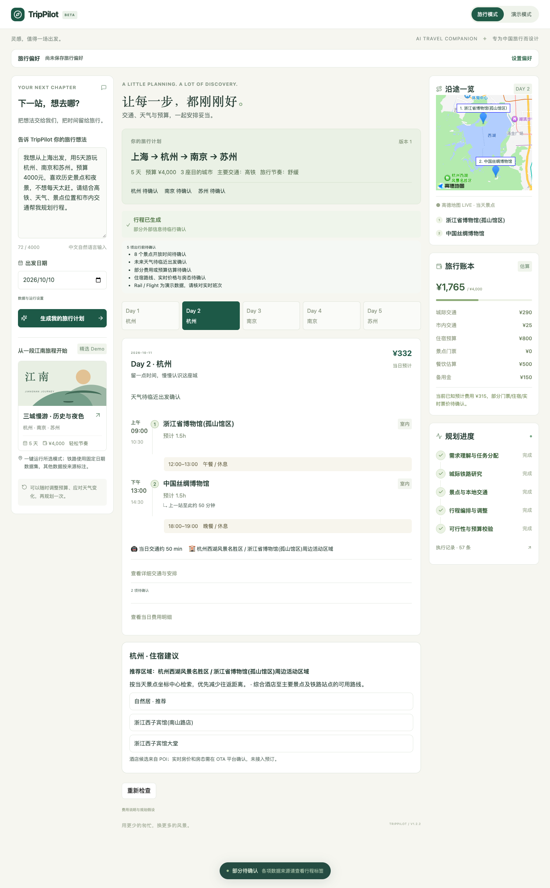
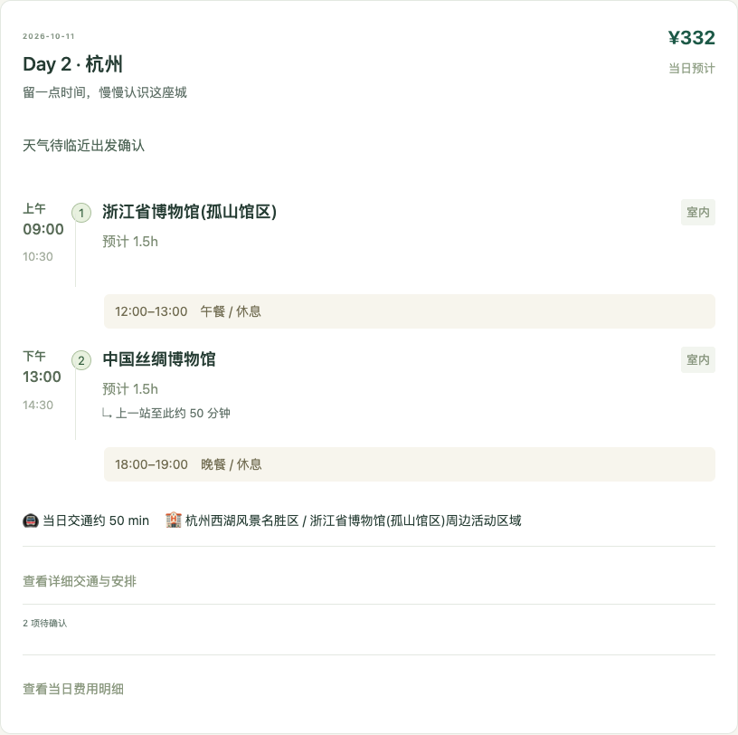
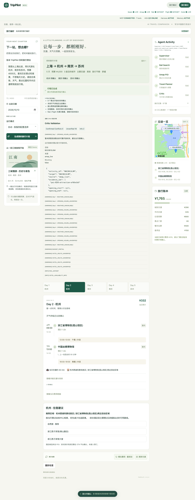
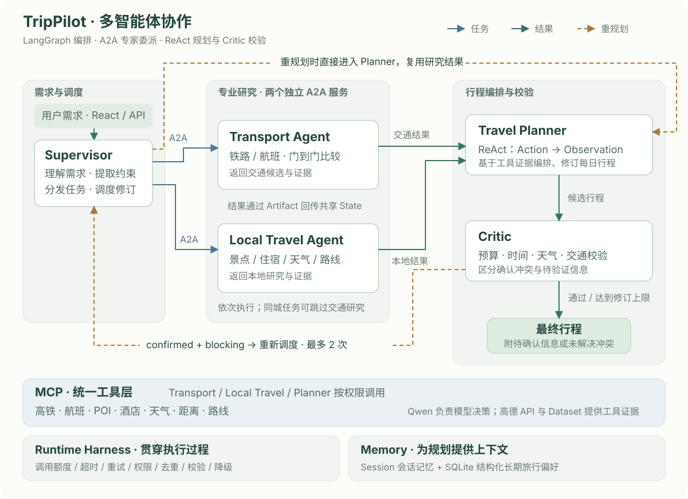

# TripPilot

**Multi-Agent AI Travel Planner · 从一句旅行想法，到一份清晰的行程。**

TripPilot 是一个面向多城市自由行的 AI 旅行规划项目。输入目的地、日期、预算和偏好，即可获得包含城际交通、每日景点、住宿建议与地图的行程；需求或天气变化时，可以继续对话调整计划。

`LangGraph` · `Qwen` · `MCP` · `A2A` · `FastAPI` · `React` · `SQLite`

## 项目演示

> 我想从上海出发，用 5 天游玩杭州、南京和苏州。预算 4000 元，喜欢历史景点和夜景，不想每天太赶。



<details>
<summary>查看每日行程与 Agent 执行视图</summary>

**每日行程**：活动时间、交通衔接、天气与费用集中展示。



**演示模式**：查看 Agent 执行摘要、工具来源与约束校验结果。



</details>

## 核心体验

- **多城市规划**：结合日期、预算与旅行节奏，安排交通、景点和每日活动。
- **交通与住宿建议**：比较铁路和航班的门到门时间，围绕景点位置推荐住宿区域。
- **地图与天气**：高德地图展示当天景点，天气摘要自然融入每日行程。
- **可持续调整**：保留会话上下文与长期偏好，支持修改预算、节奏或活动安排。
- **约束校验与重规划**：检查预算、时间、天气和交通冲突，在限定次数内尝试修订。
- **明确的信息来源**：区分实时数据、演示数据和待确认信息，便于判断行程的可靠程度。

## 系统设计

五个 Agent 分工协作：蓝色实线表示任务委派，绿色实线表示结果流转，虚线表示有界重规划。



- **协作与工具**：Supervisor 通过 A2A 依次委派两个独立专家服务；MCP 统一提供交通、POI、酒店、天气、距离和路线等 **7 个工具**。
- **运行保护**：Harness 统一约束调用额度、超时、重试、权限与重复调用，并记录降级和执行摘要。
- **校验与记忆**：确认冲突才由 Supervisor 再次调度 Planner；待验证信息保留提示。Session 保存会话上下文，SQLite 保存用户选择记住的结构化偏好。

前端使用 React，后端使用 FastAPI，LangGraph 负责流程编排。上图展示主要职责与修订关系，具体调度见 [工作流实现](backend/app/graph/workflow.py)。

## 评测结果

| 任务成功率 | TripPilot | Single-Agent Baseline |
| --- | ---: | ---: |
| 50 个固定旅行任务 | **48/50 · 96%** | 32/50 · 64% |

双方使用相同的 `qwen-plus`、固定 Provider 数据和评估器。这是项目内部单次评测，不代表真实出行成功率；正确识别不可满足的约束也可计为任务成功。

工程回归覆盖 **215 项后端测试、24 项浏览器测试**，包含协议集成、运行保护、记忆与约束校验。

[完整评测与失败案例](evals/v1_2_2/summary.md) · [评测方法](evals/v1_2_2/semantics.md)

## 本地运行

需要 **Python ≥ 3.11、Node.js 22**。在项目根目录安装依赖：

```sh
python3 -m venv backend/.venv
backend/.venv/bin/python -m pip install -r backend/requirements.txt
npm --prefix frontend ci
test -f .env || cp .env.example .env
```

参照 [配置说明](docs/local-development.md#环境变量与-mock-mode) 填写本地 `.env`，分别在两个终端启动：

```sh
# 终端 1：Backend、MCP 和两个 A2A 服务
./scripts/dev_v1_2.sh

# 终端 2：Frontend
npm --prefix frontend run dev
```

打开 **http://127.0.0.1:5173**。未配置 API 凭据时，可选择 Mock 模式体验。

## 数据与使用边界

Qwen 与高德 API 已完成真实联调。铁路、航班使用固定数据集，不代表实时班次或余票；酒店推荐来自高德 POI，不提供实时房价、库存或预订。超出预报范围的天气及缺少证据的开放时间会显示待确认。

本项目为本地工程化 Demo，不提供支付、购票或商业生产部署。

[演示指南](docs/demo-guide.md) · [开发与测试](docs/local-development.md) · [OpenSpec 开发记录](openspec/)
