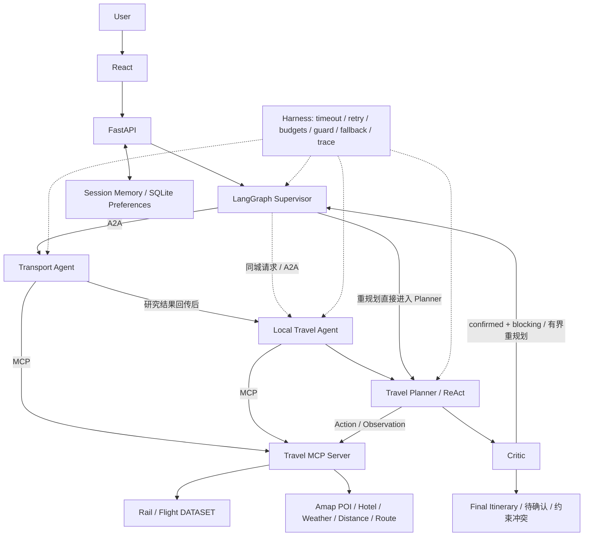

# TripPilot

**Multi-Agent AI Travel Planner**

面向中国大陆多城市自由行的 AI 旅行规划系统。根据日期、预算和偏好，协同研究交通、景点、住宿、天气与路线，生成可修订的每日行程；通过记忆与约束校验，明确区分确认冲突、待验证信息和演示数据。

## Demo

“三城慢游 · 历史与夜色”：上海出发，5 天游玩杭州、南京和苏州，预算 4000 元。


<details>
<summary>演示模式与每日行程</summary>


</details>

截图来自 V1.2.2 本地真实联调：Qwen、高德 Web Service 和 JS 地图为 LIVE，Rail / Flight 为 DATASET。未来天气和部分价格、开放时间仍待确认，行程状态为 `partial`。参见 [演示指南](docs/demo-guide.md)、[真实验收记录](docs/v1.2.2-validation-report.md) 与 [移动端截图](docs/screenshots/v122-mobile.png)。

## Architecture



五个逻辑 Agent；Transport 与 Local Travel 是两个独立 A2A 服务，由主进程依次委派。MCP 服务暴露 7 个工具。Critic 为确定性校验器，只有确认且阻断的冲突触发最多两次自动重规划。Trace 展示执行摘要，不展示模型私有推理。

## 核心能力

- LangGraph 多 Agent 规划与可追溯的行程修订。
- A2A 专业 Agent 委派、类型化任务与结果回传。
- MCP 统一交通、景点、酒店、天气、距离和路线工具。
- 受控 ReAct 与 Critic 预算、时间、天气、交通约束校验。
- Runtime Harness：额度、超时、重试、权限、去重、校验和显式降级。
- Session Memory 与 SQLite 结构化长期旅行偏好。
- 住宿区域推荐、铁路与航班门到门比较，清楚标注数据边界。
- 高德真实地图、每日 POI Marker、紧凑天气摘要及旅行/演示模式。

## Benchmark

| Metric | TripPilot | Single-Agent |
| --- | ---: | ---: |
| Task Success | 48/50 (96%) | 32/50 (64%) |

项目内部 **50 个固定旅行任务**，双方使用相同 `qwen-plus`、相同 Provider fixtures、相同 evaluator。模型调用为真实 Qwen，旅行数据为固定证据；这是单次离线评测，**不代表生产环境真实成功率，也不证明架构的因果性能提升**。正确拒绝不可满足约束可计为任务成功。

V1.2 历史结果为 44/50（88%）；V1.2.1 未单独运行正式 Benchmark。跨版本包含多项修复及模型运行波动，不能将提升全部归因于 Critic。严格重规划恢复为 1/3，仍有未解决预算案例。

[固定任务](evals/v1_2/benchmark_50.jsonl) · [最终结果与失败案例](evals/v1_2_2/summary.md) · [原始 TripPilot 结果](evals/v1_2_2/results_tripilot.jsonl) · [原始 Baseline 结果](evals/v1_2_2/results_baseline.jsonl) · [历史结果](evals/v1_2/summary.md) · [评测语义](evals/v1_2_2/semantics.md) · [简历声明核验](docs/resume-claim-audit.md)

## Limitations

- **Rail = DATASET，Flight = DATASET**，日期覆盖有限，不代表实时班次或余票；不爬取 12306。
- Hotel 来自高德 POI；不提供实时房价、库存、支付或预订。
- 未来天气、景点开放时间和部分费用需要临行确认；未知信息不会被当作已验证事实。
- 故障恢复受预算和 deadline 限制，不保证所有请求都能生成完整行程。
- 当前是本地工程化 Demo，无生产认证或商业部署声明；会话随服务重启清空，仅结构化偏好持久化。

## Quick Start

需要 **Python >=3.11、Node 22**；已验证 Python 3.13.2 / Node 22.23.2。从仓库根目录执行：

```sh
python3 -m venv backend/.venv
backend/.venv/bin/python -m pip install -r backend/requirements.txt
npm --prefix frontend ci
# 仅首次创建，不覆盖已有本地配置
test -f .env || cp .env.example .env
```

本机编辑 `.env`：

| 变量 | 用途 |
| --- | --- |
| `DASHSCOPE_API_KEY` | Qwen API Key |
| `QWEN_CHAT_MODEL` | 模型名，例如 `qwen-plus`；优先于兼容旧名 `QWEN_MODEL` |
| `DASHSCOPE_BASE_URL` | 可选，账户对应的 OpenAI-compatible Base URL |
| `AMAP_API_KEY` | 高德 Web Service Key |
| `VITE_AMAP_JS_KEY` | 高德 Web 端 JS API Key |
| `VITE_AMAP_SECURITY_CODE` | 配套安全码，由后端地图代理使用 |
| `RAIL_PROVIDER` | 填 `dataset`；Flight 默认 `dataset` |

`.env.example` 只有空占位符；`.env` 与本地 SQLite 均被忽略。后端和 Vite 读取根目录配置，安全码不注入前端包。无凭据可选择页面 Fixture 模式体验合成数据。

终端 1：统一启动 Backend、MCP 和两个 A2A 服务。

```sh
./scripts/dev_v1_2.sh
```

终端 2：

```sh
npm --prefix frontend run dev
```

访问 <http://127.0.0.1:5173>；API 文档 <http://127.0.0.1:8000/docs>。修改 `.env` 后重启服务。Demo 固定日期为 2026-10-10 起五天，超出预报范围会显示待确认。

[完整开发与测试命令](docs/local-development.md) · [最终发布验证](docs/portfolio-release-report.md)

## 项目结构

```text
backend/   Agent、协议、Provider、Harness、API 与测试
frontend/  React UI 与浏览器回归
evals/    固定任务、Baseline、原始结果及评测报告
openspec/  规范与开发历史
docs/     架构、验收、简历核验与截图
scripts/   本地统一启动脚本
```

最终回归：**215 后端测试、1 前端单元测试、24 浏览器测试通过**；Ruff、构建与 OpenSpec strict validation 通过。MCP/A2A 集成测试使用真实本地协议、受控 Provider；LIVE 验收单独留证。本次发布未重新运行昂贵的 50+50 Benchmark。
