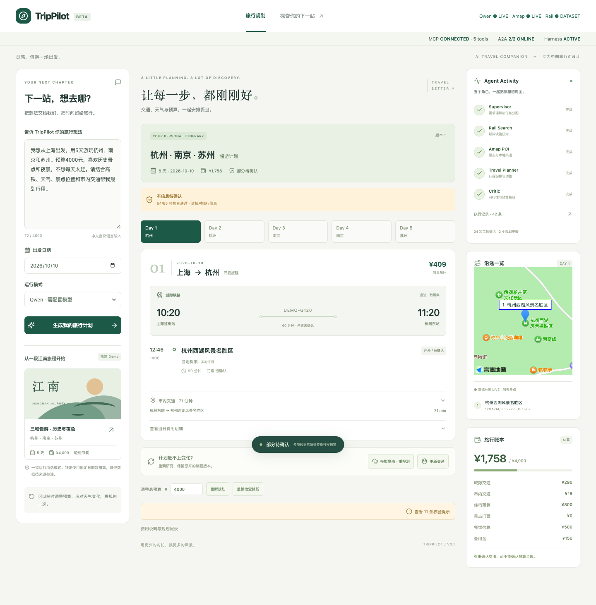
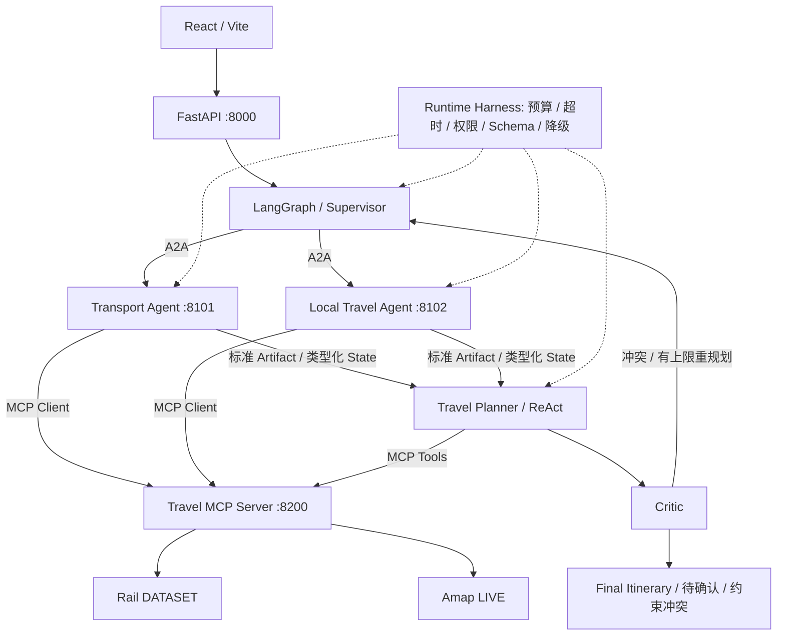

# TripPilot

**Multi-Agent AI Travel Planner · 让每一步，都刚刚好。**

TripPilot 是面向中国大陆旅行场景的本地 AI 应用 Demo。它通过 **LangGraph、Multi-Agent、ReAct 和 Tool Calling**，把旅行需求拆成铁路研究、本地景点/天气/路线研究、行程编排，以及预算和可行性校验。

它能生成带来源标签的多日行程，在暴雨、交通变化或预算冲突时进行有上限的 **Dynamic Replanning**。V1.1 通过官方 MCP 和 A2A SDK 连接真实的本地独立服务，以统一 Agent Runtime Harness 控制执行。Qwen `qwen-plus`、高德 Web Service 和浏览器地图保持 LIVE，铁路为 Dataset；无 Key 时仍可显式运行完整 Mock Demo。



**V1.1 验收：** 真实 MCP/A2A 集成、Harness 边界测试、五天 LIVE 行程、暴雨重规划和预算冲突均已验证。状态标签来自实际探测与本次执行。详见 [V1.1 验收记录](docs/v1.1-validation-report.md)；[V0.2 历史记录](docs/v0.2-live-report.md) 保留。

[手机布局截图](docs/screenshots/demo-mobile.png) · [故障降级截图](docs/screenshots/provider-outage.png) · [录屏演示脚本](docs/demo-guide.md)

## 快速体验

打开前端后，点击左侧 **「三城慢游 · 历史与夜色」**。这会运行真实的本地工作流，而不是仅展示一张预设结果卡片：

> 我想从上海出发，用5天游玩杭州、南京和苏州。预算4000元，喜欢历史景点和夜景，不想每天太赶。请结合高铁、天气、景点位置和市内交通帮我规划行程。

Demo 日期固定为 **2026-10-10 起五天**。Mock 模式使用合成证据；LIVE 模式通过真实 Qwen、高德、MCP、A2A 获取结果，铁路仍为固定日期 Dataset，列车标记为 `DEMO-G…`。LIVE 模式缺失的预报、票价与开放时间保留未知，不能视为全部已验证。普通请求缺少日期时会先要求补充。Mock 的中文解析主要覆盖上海、杭州、南京、苏州；其他城市需要真实模型与相应 Provider 数据支持，不能保证完整覆盖。

## 架构与 Multi-Agent 工作流



| 角色 | 职责 |
|---|---|
| Supervisor | 结构化约束提取、日期澄清、确定性路由；同城行程跳过铁路 |
| Transport | Rail Search，获取有来源的车站、时刻、费用、换乘信息 |
| Local Travel | 景点、室内备选、天气及市内交通研究；使用正常工具调用 |
| Travel Planner | ReAct 选择工具、读取 Observation、组合与修订行程 |
| Critic | 时间、车站缓冲、换乘、开放时间、密度、天气、路线及预算校验 |

保留原有五个逻辑 Agent。Transport、Local Travel 分别运行在独立 A2A 服务中；MCP 工具服务复用已有 Provider，主进程保留 LangGraph、Supervisor、Planner 和 Critic。没有外部队列或数据库，任务仅保存在进程内存中。显式 Mock 模式默认沿用 V0.2 本地路径；协议集成测试可显式开启协议 Fixture。

| 技术 | 实际职责 |
|---|---|
| LangGraph | 工作流编排与状态流转 |
| ReAct | 动态 action / observation 决策循环 |
| MCP | Agent 与 Tool 的标准协议；Streamable HTTP |
| A2A | Agent 与 Agent 的发现、任务及 Artifact 协议 |
| Harness | 运行预算、权限、超时、重试、校验、降级及安全事件 |
| Critic | 独立确定性约束验证 |
| Dynamic Replanning | 根据冲突自动修订，达到上限后明确终止 |

## ReAct 与执行边界

Planner 的每一步产生结构化 `action` 或 `final` 决策。Action 只能访问注册且授权的工具，Observation 带结构化数据和错误码，随后再决定下一步。Mock 模式用可重复的策略代替模型决策；Qwen 模式通过同一接口请求结构化决策。Mock 演示不等于真实 LLM 推理质量证明。

- 每轮 Planner 最多 **8 步**，单轮 **90 秒**；一次运行最多 **180 秒活动执行时间**。
- 全局最多 **40 次工具尝试**、**30 次模型尝试**、**160 次外部调用尝试**；重试和格式修复也计数。外部调用含协议请求和下游 Provider 请求。
- A2A 任务最多 **60 秒**，MCP 请求最多 **15 秒**。委派先预留额度、收到可信用量后结算；响应丢失时保留已预留额度，防止 fallback 重置预算。
- 工具超时 **10 秒**，模型超时 **30 秒**；可重试错误最多重试一次。
- 同一证据版本下，相同调用第二次复用缓存，超过默认阈值 2 则拒绝；重复失败调用立即停止。Harness 记录 `DUPLICATE_TOOL_CALL` / `TOOL_NOT_ALLOWED` 等原因，兼容原 API 错误码。
- 仅对可恢复故障重试；认证、权限和普通 schema 错误不重试。模型结构修复走同一策略并计数。MCP/A2A 降级明确记录 `MCP FALLBACK` / `A2A FALLBACK`，本地执行仍受剩余预算控制。
- Critic 最多触发 **2 次重规划**；相同问题修复无效时提前停止。
- UI Trace 只展示安全的工具动作、结果摘要、时序和耗时，不展示私有 chain-of-thought、提示词或密钥。

## Amap 与 RailProvider

高德作为工具提供方，封装 `AmapPOITool`、`AmapRouteTool`、`AmapDistanceTool`、`AmapWeatherTool`。真实适配器支持 POI/餐馆、步行/驾车/公交路线、距离和天气，具体可用性受账户权限和覆盖范围限制。公交、预报日期等不支持时返回受控结果；缺少开放时间或票价会保留未知状态。坐标统一标注 **GCJ-02**。

未提供 `AMAP_API_KEY` 时使用 `MockAmapProvider` 并标注来源。即使 Qwen 为真实模型，也可能组合 Mock 铁路/高德数据，不能把整份结果当作实时计划。

| Rail Provider | 当前状态 |
|---|---|
| `MockRailProvider` | 已实现，可重复的合成直达车次 |
| `DatasetRailProvider` | 已实现，版本化日期固定的直达/换乘数据集 |
| `RealRailProvider` | 接口占位，返回未配置；等待合法授权 API |

没有 12306 爬虫、出票或购票操作。高德浏览器地图与 Web Service Key 是不同接入面；当前已接入高德 JS API 2.0、当天 Marker 和自动视野，同时保留 POI/坐标 fallback。安全码由后端 `/_AMapService` 代理添加，Web Service Key 不进入浏览器。真实底图、Marker 名称、日切换与自动视野已在独立 Chrome 中验收。

官方接口参考：[Qwen 调用说明](https://help.aliyun.com/en/model-studio/first-api-call-to-qwen)、[高德路线 API](https://lbs.amap.com/api/webservice/guide/api/direction)、[高德 POI API](https://lbs.amap.com/api/webservice/guide/api/search/)。账户区域、模型和服务权限需要在真实联调前核对。

## Constraint-aware Planning 与 Critic

Critic 输出 `valid`、`issues`、每条问题的 `severity` / `suggestion`、已检查约束和未验证项目。已知硬冲突不能被包装为成功；未知信息产生 `partial`，无法满足的硬约束产生 `conflict`。

费用按整数分计算：城际交通、市内交通、住宿占位、景点门票、餐饮估算、备用金。每日费用、分类费用与总额核对；未知票价不按零处理，跨日铁路只计费一次。默认一位成人、不自动添加返程；酒店和住址未提供时不推测接驳位置。

「模拟暴雨 · 重规划」会更新模拟天气，产生新版本，将受影响的户外活动改到室内，重新查询缺失路线并整体验证。更新交通、调整预算和重新检查路线也创建关联的新任务，旧版行程在新版生成期间保留。

## 本地环境与安装

已在 macOS arm64、Python **3.13.2**、Node **22.23.2** 上验证。不要使用本机默认 Python 3.8。

在仓库根目录运行：

```sh
/usr/local/bin/python3.13 -m venv backend/.venv
backend/.venv/bin/python -m pip install -r backend/requirements.txt
export PATH="$PWD/.tooling/runtime/node_modules/.bin:$PATH"
npm --prefix frontend ci
```

`.tooling/` 是本机安装、已忽略的 Node/OpenSpec 目录，新克隆不包含它。其他机器先安装兼容 Node 22，再直接使用 `npm`；Python 可用其他兼容的 >=3.11 解释器替换上述绝对路径。依赖锁定在 `backend/requirements.txt` 和 `frontend/package-lock.json`。

## 环境变量与 Mock Mode

**不配置任何 Key 即可启动、测试和完成 Demo。** 本地 `.env` 由用户填写并被 Git 忽略；`.env.example` 始终只有空占位符。不要展示或提交本地凭据。

| 变量 | 用途 |
|---|---|
| `DASHSCOPE_API_KEY` | 真实 Qwen 认证，仅后端读取 |
| `QWEN_CHAT_MODEL` | 首选模型变量，账户可用的模型 ID，无硬编码默认模型 |
| `QWEN_MODEL` | 旧版兼容回退；首选变量非空时不生效，无需同时填写 |
| `DASHSCOPE_BASE_URL` | DashScope 兼容 API 地址；留空采用原有默认值 |
| `AMAP_API_KEY` | 高德 Web Service Key，仅后端读取 |
| `VITE_AMAP_JS_KEY` | 浏览器地图 SDK 的 JS API Key，与 Web Service Key 分开 |
| `VITE_AMAP_SECURITY_CODE` | 配套安全码；由后端读取并代理附加，不编入浏览器代码 |
| `RAIL_PROVIDER` | 空或 `mock` / `dataset` / `real` |
| `RAIL_API_KEY` | 未来授权铁路适配器预留，当前不使用 |

如要配置真实调用，在本机环境变量或本地 `.env` 中自行填写，不要提交或把 Key 发到聊天中。Settings 会读取仓库根目录的 `.env`。模型只保留一个内部值，优先读取非空 `QWEN_CHAT_MODEL`，不存在时回退到 `QWEN_MODEL`；同名变量由进程环境优先于 `.env`，旧名称不会覆盖 `.env` 中的首选名称。默认 DashScope 地址为北京兼容接口；若账户要求 Workspace 专属域名或其他区域，可额外设置 `DASHSCOPE_BASE_URL` 为控制台提供的完整兼容 API Base URL（HTTPS，阿里云域名）。模型/账户不匹配会返回受控错误，不会静默伪造实时结果。

- `fixture`：固定模拟模型和高德数据；铁路按配置选择，默认 Mock。
- `auto`：有完整 Qwen 配置时使用 Qwen，否则使用 Mock；高德也独立按 Key 选择。
- `live`：明确要求 Qwen，配置不足时返回提示；高德无 Key 仍采用带标签的 Mock。
- 直接注入雨天/故障场景只允许 `fixture`；真实行程的“模拟暴雨”修订会明确标注模拟来源，POI/路线继续查询真实高德。
- Demo 卡片遵循当前模式选择，不再强制切换 Mock。默认 `auto`；真实联调请选择 `live`，缺模型配置会失败。
- 页面 Provider 标签来自本次请求：`PENDING` 尚未验证、`LIVE` 调用成功、`FAILED` 真实调用失败、`MOCK` 实际模拟、`DATASET` 实际数据集。失败不会静默切换成 Mock。

## 启动 V1.1 Backend 服务

终端 1，在仓库根目录，一条命令启动四个独立进程：

```sh
./scripts/dev_v1_1.sh
```

默认端口：主后端 `8000`、Transport A2A `8101`、Local Travel A2A `8102`、Travel MCP `8200`。启动器通过进程环境启用协议，读取根目录 `.env`，不复制凭据；端口占用时直接停止启动，不终止已有程序。Ctrl+C 清理本次启动的子进程；单个协议服务故障时其余服务继续运行并允许受控 fallback。日志和 PID 清单写入已忽略的 `.tooling/v11/`。

配置集中在 `Settings`：`MAIN_PORT`、`MCP_URL`、`A2A_TRANSPORT_URL`、`A2A_LOCAL_URL`；协议地址只允许本机 HTTP。`PROTOCOLS_ENABLED` 控制主进程是否使用协议，启动器自动启用。各服务均可从 `backend/` 独立启动：

```sh
.venv/bin/python -m uvicorn app.mcp.server:create_app --factory --host 127.0.0.1 --port 8200 --no-access-log
.venv/bin/python -m uvicorn app.a2a.service:transport_app --factory --host 127.0.0.1 --port 8101 --no-access-log
.venv/bin/python -m uvicorn app.a2a.service:local_app --factory --host 127.0.0.1 --port 8102 --no-access-log
PROTOCOLS_ENABLED=true .venv/bin/python -m uvicorn app.main:create_app --factory --host 127.0.0.1 --port 8000 --no-access-log
```

四条独立启动命令分别占用终端；端口调整时同时更新对应配置。原 V0.2 单进程入口 `app.main:app` 仍可用，未启用协议时显示 DISABLED。

策略由 `backend/app/harness/policy.py` 统一定义，可用嵌套环境变量覆盖，例如 `RUNTIME_POLICY__MAX_TOOL_CALLS=40`、`RUNTIME_POLICY__MCP_TIMEOUT_SECONDS=15`。所有服务使用同一配置。修改 `.env` 后重启服务，Vite 的主后端代理端口跟随 `MAIN_PORT`。

健康检查：<http://127.0.0.1:8000/health>；API 文档：<http://127.0.0.1:8000/docs>。

## 启动 Frontend

终端 2，在仓库根目录：

```sh
export PATH="$PWD/.tooling/runtime/node_modules/.bin:$PATH"
cd frontend
npm run dev
```

打开 <http://127.0.0.1:5173>。Vite 代理 `/api` 和 `/health` 到本地后端。UI 使用短轮询，未引入 SSE/WebSocket。

主要 API：

| 方法 | 路径 | 行为 |
|---|---|---|
| GET | `/health` | 结构化健康状态，不返回凭据 |
| POST | `/api/plan` 或 `/api/v1/plans` | 202 返回 `run_id` / `task_id` 和轮询地址 |
| GET | `/api/trace/{task_id}` 或 `/api/v1/plans/{task_id}` | 状态、Trace、结果；支持 `after_sequence` |
| POST | `/api/v1/plans/{task_id}/clarifications` | 按 `expected_revision` 补充信息 |
| POST | `/api/v1/plans/{task_id}/revisions` | 天气/交通/预算/路线修订 |
| POST | `/api/v1/plans/{task_id}/cancel` | 幂等取消 |

最多 2 个活动任务，最多保留 50 个已结束任务，保留时间 60 分钟；进程重启清空。请求体上限 64 KiB。状态包括 `needs_clarification`、`completed`、`partial`、`conflict`、`failed`、`cancelled`。

## Tests

```sh
# 仓库根目录：后端测试隔离本地 .env，禁止真实外部 HTTP
backend/.venv/bin/python -m pytest -q -c backend/pyproject.toml backend/tests
backend/.venv/bin/ruff check backend/app backend/tests backend/live_check.py evals scripts
npm --prefix frontend test
npm --prefix frontend run build

# 先启动前后端；浏览器 E2E 使用独立临时浏览器配置
export PATH="$PWD/.tooling/runtime/node_modules/.bin:$PATH"
frontend/node_modules/.bin/playwright test --config frontend/playwright.config.ts
```

当前回归：**141 后端测试**（原117 + Harness14 + 协议10）、**1 前端单元测试**、**8 浏览器测试**全部通过。协议测试真实监听临时本地 TCP 端口，调用官方 SDK；只允许 loopback HTTP，不消耗真实 Provider API。LIVE 浏览器证据另存于验收报告，不能与 Mock 回归混淆。

macOS 测试默认使用已安装的 Google Chrome；其他环境可先执行 `cd frontend && npx playwright install chromium`。测试涵盖工具合同、权限、超时、Qwen 错误/修复、路由、ReAct 限制、Critic、预算、重规划、API 生命周期以及浏览器流程。

## Evaluation

```sh
PYTHONPATH=backend backend/.venv/bin/python -m evals.runner
```

24 个固定场景见 [cases.jsonl](evals/cases.jsonl)，原始计数、耗时、证据哈希见 [fixture-results.json](evals/reports/fixture-results.json)。最后一次本地运行 **24/24 符合预期**；其中包括正确澄清、拒绝冲突和故障降级，并不是 24 份真实旅行计划都成功。

指标包括任务预期完成、路由正确性、工具选择、约束满足、预算合规、路线可行性、无依据交通声明、Agent 步数、延迟及 Token 用量。Fixture 没有真实 Token 消耗记录，Token 为 `null`。延迟只代表本地合成工作流，不能用来声称真实模型响应速度。

[简单单次 LLM 与 Multi-Agent 比较入口](evals/compare.py) 已实现，双方使用同一模型设置、合成证据空间和确定性校验器。**真实比较未运行，无提升百分比。** 如以后允许付费真实模型评估，可配置账户后手动运行：

```sh
PYTHONPATH=backend backend/.venv/bin/python -m evals.compare --allow-paid-model --case 01
```

错误草案注入属于 fixture 控制实验，真实模型比较会单独记录其测试范围。详见 [评估定义](docs/evaluation-plan.md)。

## 已知边界

- 这是本地求职展示项目，不提供支付、购票、酒店预订或生产级认证。
- 高德四类接口和 Qwen qwen-plus 均有真实请求证据。实时开放时间、票价、预报可能缺失，结果可为 partial。
- Mock 的行程编排采用可重复策略，不是通用中文理解器或全局最优路线求解器。
- 数据集日期覆盖有限；超出范围的天气和铁路不会被当作已知。没有酒店地址时不验证酒店接驳。
- 真实互动地图已验收；授权实时铁路与 FlightProvider 未实现。
- MCP 已使用官方 `mcp==2.2.0`，A2A 已使用官方 `a2a-sdk[http-server]==1.1.5`；真实本地协议集成与 LIVE E2E 已通过。标准协议承载类型化领域数据，不新增模型 Agent。
- A2A 采用阻塞响应任务，若在获取 task id 前断连，只能依赖远端 deadline 收束；保守保留委派预算，可能返回受控失败而非保证所有故障都能完成行程。
- 服务仅面向本地 Demo：无认证、持久化或生产部署保证，A2A SDK 任务存储为内存实现。
- **Rail remains DATASET, not real-time 12306 availability.** 不支持真实订票。

## 工程与 OpenSpec

[AGENTS.md](AGENTS.md) · [设计](openspec/changes/trippilot-v0-1/design.md) · [33 项任务](openspec/changes/trippilot-v0-1/tasks.md) · [验收记录](docs/acceptance-report.md)

```sh
export PATH="$PWD/.tooling/runtime/node_modules/.bin:$PWD/.tooling/openspec/bin:$PATH"
OPENSPEC_TELEMETRY=0 openspec validate --all --strict --no-interactive
```

V1.1 变更见 [设计](openspec/changes/trippilot-v1-1-agent-protocols-harness/design.md) 和 [任务](openspec/changes/trippilot-v1-1-agent-protocols-harness/tasks.md)。稳定 V0.2 已创建本地 checkpoint `209918f`，V1.1 在 `feat/v1.1-agent-protocols-harness` 开发；没有 push、merge 或自动归档。

可如实用于简历的能力：**Multi-Agent / LangGraph / ReAct / MCP / A2A / Harness Engineering / Critic 与 Dynamic Replanning**。对应依据是实际协议集成测试、Harness 边界测试和真实 Qwen + 高德浏览器 E2E；不声称生产级分布式平台或未经测量的性能提升。
