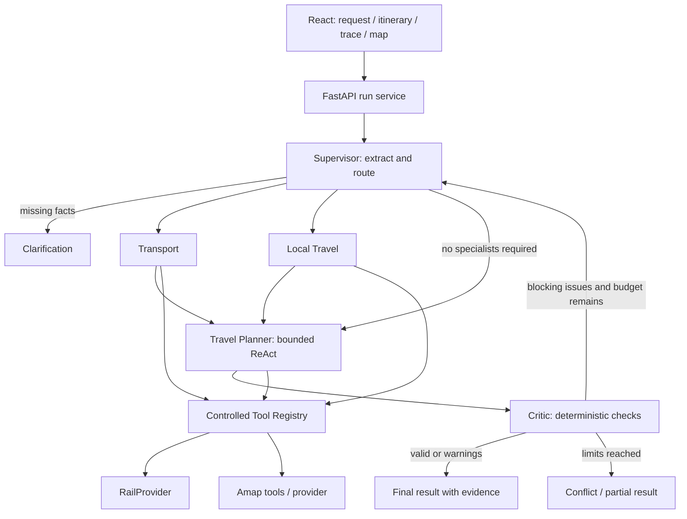

# Design

## Context

See [proposal.md](proposal.md) for motivation. This is an empty application repository with a completed tooling bootstrap; there is no legacy code or migration to preserve. The initial deliverable is documentation only. The target is a mainland China local portfolio demo built in roughly 16 focused hours after approval.

## Goals / Non-Goals

**Goals:** Ground itinerary decisions in typed evidence; keep loops and tool access auditable; demonstrate useful failures as well as successful itineraries; support a keyless fixture demo plus a configured Qwen/Amap path.

**Non-goals:** No autonomous write actions, distributed infrastructure, booking, continuous background weather monitoring, or production durability. MCP/A2A are documented boundaries only. A live rail adapter is optional until an authorized provider is selected. A map key is not a prerequisite for the core demo.

## Decisions

### 1. One process, five logical agents

Use FastAPI with an async LangGraph state machine in one backend process. React/Vite/TypeScript is a separate local dev server. No queue server, database server, or separate agent deployments. A small in-memory run store supports polling and cancellation; optional persistence is deferred. Alternatives such as microservices or an agent per tool add integration cost without improving this demo.



This diagram expresses dependencies; implementation uses a deterministic specialist sequence (Transport then Local when needed) before Planner to avoid concurrent state merges on day one. The conditional Supervisor feedback edge preserves original constraints and passes Critic findings to Planner; it does not repeat intent extraction. The graph recursion limit is a final fuse, never the primary termination rule.

| Agent | Responsibility | Execution and access |
|---|---|---|
| Supervisor | Extract intent, ask clarifications, route, collect specialist outputs | Structured schema-constrained model call plus deterministic routing; no provider tools |
| Travel Planner | Order destinations, compose days, request missing evidence, revise drafts | ReAct with typed action/final union; rail/POI/route/distance/weather read tools through registry |
| Transport | Inter-city rail, stations/times/fares/types, direct/transfer feasibility | Normal structured tool calls to rail only; no website dependency |
| Local Travel | POIs/restaurants, local routes/distances, weather | Deterministic Amap calls first; optional bounded ReAct for multi-step local selection |
| Critic | Check feasibility, coverage, cost, density, weather, route efficiency | Deterministic validation over evidence; no unrestricted tool access or mandatory LLM call |

ReAct means internal Reason → typed Action → Observation → next decision. Expose a short action rationale only; never expose private chain-of-thought. The Planner can directly request permitted evidence tools, avoiding a sixth coordinator or nested agents-as-tools.

### 2. Typed contracts and shared state

Pydantic models validate all boundaries. LangGraph uses a TypedDict whose fields reference these models. All datetimes are ISO 8601 with Asia/Shanghai offset; comparisons use aware instants. Relative dates resolve against an injected clock in Asia/Shanghai. Day count includes arrival/departure days. Default: one adult, CNY, standard rail seat class, no return-to-origin unless requested; these assumptions are visible and editable. Missing calendar dates require clarification for live schedules; a separate explicitly labeled fixture demo supplies fixed fixture dates. Do not silently invent dates.

| State field | Type / invariant |
|---|---|
| `run_id`, `user_query` | UUID, nonempty string <=4000 characters |
| `origin`, `destinations` | CityRef or null, ordered unique list[CityRef]; CityRef = name + optional provider city code |
| `travel_dates` | TravelDates or null: start/end date, positive day_count with consistency check |
| `total_budget` | Money or null: integer minor units >=0, currency fixed CNY |
| `preferences`, `constraints` | Preferences and Constraints, explicit hard/soft distinction |
| `transport_options` | list[RailOption] with evidence references |
| `poi_candidates` | list[POI] grouped by city |
| `weather_data`, `route_data` | list[WeatherRecord], list[RouteOption] |
| `draft_itinerary`, `final_itinerary` | Itinerary or null; final populated only with validated or clearly partial output |
| `validation_result` | ValidationResult or null |
| `replanning_count` | integer 0..2; global per run |
| `agent_trace` | append-only list[TraceEvent] with monotonic sequence |
| `status` | queued/running/needs_clarification/completed/partial/conflict/failed/cancelled |
| `evidence`, `assumptions`, `unverified_checks` | typed source index and explicit uncertainty lists |
| `step_counts`, `tool_attempt_count`, `llm_attempt_count`, `deadline_at` | global execution budgets; preserved across re-planning |
| `routing_plan`, `clarification_questions`, `revision` | typed specialist selection, questions, optimistic revision counter |

Supporting model contracts:

- `Constraints`: required destinations, duration, total budget, max attractions/day (relaxed default 3), max local travel/day (relaxed default 120 minutes), activity window (relaxed default 09:00–20:00), minimum rail station buffer (default 45 minutes), rail interchange buffer (default 30 minutes), walking limit if supplied. Night-view preference explicitly permits an evening activity window to 21:30; no silent relaxation of hard bounds. Thresholds are demo planning policies, not provider guarantees.
- `Evidence`: id, provider, source_kind (`mock|dataset|live|estimate`), retrieved_at, valid_for dates, optional license/source label, stale flag, quality notes. No synthetic entry masquerades as live.
- `ToolResult[T]`: status (`ok|empty|unavailable|error`), data or null, evidence list, error or null. Error = code, safe message, retryable; codes include TIMEOUT, RATE_LIMITED, AUTH_REQUIRED, UNSUPPORTED, INVALID_INPUT, PROVIDER_FAILURE, DEADLINE_EXCEEDED. Distinguish empty search from provider failure.
- `RailOption`: option_id, legs with train_number, train_type, departure/arrival station IDs and city names, departure/arrival aware timestamps, duration_minutes, seat_class, fare_minor or null, availability (`unknown|available|unavailable`), evidence_id; aggregate transfer_count and fare. A missing fare remains unknown. Dataset schedules do not imply sellable seats.
- `POI`: id, name, city, category, indoor/outdoor/unknown, GCJ-02 coordinates or null, recommended_visit_minutes, ticket_estimate_minor or null, opening intervals or unknown, evidence_id. Restaurant search is the same contract with category restaurant.
- `RouteOption`: origin/destination references, mode (`walk|drive|transit`), departure_at if relevant, duration_minutes, distance_meters, fare_minor or null, route geometry optional, evidence_id. Straight-line distance is labeled and never substituted for a timed route.
- `WeatherRecord`: city, valid_at or date, condition, severity (`normal|adverse|severe|unknown`), temperature if supplied, evidence_id. Provider forecast horizon limits applicability; no forecast for unsupported future dates.
- `Itinerary`: version, days, inter-city legs, assumptions, evidence_ids, cost_summary, warnings. Day = date, city sequence, timed activities, explicit local legs, day cost. Activities link POI IDs rather than reproducing invented details.
- `CostSummary`: six category subtotals, estimated_total_minor, unknown_items, budget_minor, delta_minor. Accommodation/food/reserve use explicit per-person/per-night estimates; accommodation nights default day_count minus one. Display rounded yuan, compute in integer fen.
- `ValidationResult`: valid bool, issues list, checked_constraints list, unverified_checks list. Issue = stable type, severity (`low|medium|high`), message, day/leg references, observed and allowed values, evidence IDs, suggested correction. Blocking hard violations are high; unknown verification is medium and results in partial status. `valid` means no known blocking violations, not verified completeness.
- `TraceEvent`: sequence, run_id, itinerary_version, agent/tool label, status (`pending|running|succeeded|failed|skipped`), timestamp, duration_ms, safe summary, evidence IDs, usage metadata if available. Never include full prompts or raw model reasoning.

### 3. Qwen adapter and offline behavior

Use a thin async Qwen client behind a `ModelClient` interface; hosted DashScope credentials and model ID come from DASHSCOPE_API_KEY and QWEN_MODEL. Select and document the account-compatible endpoint/model during implementation by checking official documentation; do not assume a model name or region. Validate tool decisions and structured output with Pydantic regardless of model support. One schema repair is allowed and consumes the normal retry and LLM budgets. Invalid output after repair becomes a controlled failure.

A deterministic fixture ModelClient is for tests and explicitly labeled fixture demo only. It must not count as a measured LLM baseline. Missing live credentials returns actionable configuration status; explicit fixture mode runs without keys. No silent switch to synthetic results after a live failure. Alternatives: a provider-heavy abstraction framework or multiple model vendors are unnecessary for V0.1.

### 4. Registry and provider boundaries

`Agent → Tool Registry → typed Tool → Provider`. Registry metadata contains tool name, version, input schema, output schema, allowed agents, read-only flag, timeout, retry policy. Reject unauthorized calls before provider execution. Validate output as well as input; normalize external exceptions. No arbitrary URLs, shell commands, browser access, or HTML parsers are registered.

| Interface / tool | Typed input | Typed output | Implementation scope |
|---|---|---|---|
| RailProvider.search | RailQuery: cities/stations, date, passengers, seat class, direct/transfer preference | ToolResult[list[RailOption]] | MockRailProvider + DatasetRailProvider required; RealRailProvider contract and unconfigured controlled error, live adapter deferred |
| AmapPOITool | POIQuery: city, keywords/category, bounded page limit | ToolResult[list[POI]] | AmapProvider plus fixture adapter |
| AmapRouteTool | RouteQuery: coordinates, city, mode, optional departure | ToolResult[list[RouteOption]] | Walk/drive; transit only where provider supports it |
| AmapDistanceTool | DistanceQuery: coordinate pairs and supported mode | ToolResult[list[DistanceResult]] | Meters plus methodology; route tool supplies travel time |
| AmapWeatherTool | WeatherQuery: city and requested dates | ToolResult[list[WeatherRecord]] | Amap weather; unsupported horizon returns unavailable/partial coverage |

Provider switching is dependency injection driven by RAIL_PROVIDER (`mock|dataset|real`; empty defaults mock with visible label). Rail data uses curated synthetic or legally reusable dated fixtures with provenance, never unauthorized scraping. A RealRailProvider adapter is accepted later only with an authorized documented API. FlightProvider is a future interface concept only.

Amap coordinates remain GCJ-02 throughout provider data and map display; coordinate systems are explicit at boundaries. Never combine WGS-84 and GCJ-02 without an explicit conversion. Opening times, fares, transit, and geometry can be unavailable. UI and Critic preserve uncertainty. Request only city/route data needed by the plan; cap POI results at 20 per city and rail options at 10 per requested connection, itinerary length at 7 days and required destinations at 4 for the local demo. Larger inputs receive a clear scope message.

### 5. Bounded execution policy

| Budget | Default | Exhaustion behavior |
|---|---|---|
| Planner max_steps | 8 per planning pass | Return best available draft for Critic or partial failure |
| Local optional ReAct max_steps | 4 per run, shared across revisions | Use available evidence with warnings |
| Automatic re-plans | 2 after initial draft; <=3 Critic passes | Conflict or partial output with remaining issues |
| External tool attempts | 40 per run, including retries | No more provider calls; validate best draft |
| LLM attempts | 30 per run, including repair/retries | Controlled partial/failed outcome |
| External tool timeout | 10 seconds per attempt | At most one retry on transient faults |
| LLM timeout | 30 seconds per attempt | At most one retry/repair within budget |
| Planning pass deadline | 90 seconds | Cancel pass and validate available draft |
| Overall run deadline | 180 seconds | Cancel child calls and emit terminal result |
| Graph recursion limit | 64 transitions | Controlled failure, never an uncaught recursion error |

A Planner step is one decision attempt (including failed generation/repair) with at most one requested tool action. Finalization consumes a decision step. All specialist calls share the same global tool budget. Deadlines use a monotonic clock. Reserve local CPU time to package terminal status without performing new external work after the deadline. A run is bounded by whichever limit is reached first.

Retry only timeouts, network interruptions, and rate limits, with one short jittered backoff capped at 1 second and remaining deadline; honor longer Retry-After by failing promptly rather than sleeping past the budget. Never retry authentication, invalid inputs, unsupported capability, or denied tools. Hash tool name plus canonical validated arguments plus evidence revision: repeated successful requests reuse cached evidence; a second identical failed request after its allowed transport retry terminates that action with DUPLICATE_ACTION and consumes a step. A weather refresh creates a new evidence revision, not permission to erase global budgets.

Termination is explicit typed final output or any step/deadline/cancellation bound. Fallback never fabricates missing train details. If no usable draft exists return failed; if hard constraints cannot be met return conflict; otherwise return partial with uncertainties. A valid complete itinerary returns completed.

### 6. Critic, budget, and dynamic revisions

Use deterministic checks for chronology/overlap, all required cities, day count, station arrival, interchanges, attraction opening intervals when present, route travel durations, density, and integer-fen totals. A leg is feasible only if departure follows prior activity end + observed route duration + applicable buffer. For different-station transfers include station-to-station route duration as well as the 30-minute interchange buffer. Missing route duration creates an unverified check, never zero minutes. Cross-midnight train legs retain full dates.

Budget = inter-city transport + local transport + accommodation placeholder + attraction tickets + food estimate + miscellaneous reserve. Each item has an ID and is counted once: cross-day rail fare is assigned to departure day; per-day totals reconcile exactly with trip total. Missing costs remain unknown; a known subtotal below the cap cannot prove budget compliance. Estimated totals greater than budget raise BUDGET_EXCEEDED. Planner may replace costly activities/options or suggest a changed budget; it cannot change the user's hard constraint itself.

Check route inefficiency by comparing provider-supported route totals for current order and at most two simple alternatives over the same POI set; a >30% avoidable increase raises ROUTE_INEFFICIENCY (medium unless a hard daily travel bound also fails). Avoid a route optimizer service. Weather fixture severe rain + outdoor POI raises WEATHER_RISK (high); unknown forecasts produce an unverified warning. Opening data unavailable produces OPENING_TIME_UNKNOWN, not a claim that a POI is open. User priority can make preferred density/window hard; defaults above are visible policies.

Critic emits issues including TIME_CONFLICT, OPENING_TIME_CONFLICT, TRAIN_DEPARTURE_RISK, TRANSFER_RISK, EXCESSIVE_TRAVEL, EXCESSIVE_DENSITY, BUDGET_EXCEEDED, ROUTE_INEFFICIENCY, MISSING_DESTINATION, WEATHER_RISK. On initial blocking issues or actionable medium route/weather issues, Supervisor passes evidence and issue references to Planner; increment replan count before transition. Stop repeated identical issue signatures after one unsuccessful repair rather than spending all remaining attempts. Planner revises affected days, refreshes relevant route evidence, and Critic rechecks the whole itinerary. Do not discard user constraints or unaffected evidence.

Dynamic change is request-triggered, not a polling scheduler: a UI refresh/revise action initiates a new run linked to prior run/version. Newly observed provider results during active planning remain within the current run and its existing budgets. Within that run the same two-replan/180-second budgets apply. A changed weather snapshot invalidates affected routes/activities; a train conflict selects another evidenced service; budget overflow revises costs; inefficient ordering recomputes route timing. Never overwrite the prior visible plan until the revision is validated; show version and revision status.

### 7. API and frontend contract

All endpoints live under `/api/v1` except `/health`. Backend binds loopback by default. Single-process async tasks are sufficient; no process-durable job guarantee.

| Endpoint | Request | Response |
|---|---|---|
| GET /health | none | 200 status and mode; no secrets |
| POST /api/v1/plans | query, optional structured constraints, explicit mode live/fixture | 202: run_id, status, revision, poll_url |
| GET /api/v1/plans/{id} | optional after_sequence | 200: status, public state, new trace events, questions/result/error |
| POST /api/v1/plans/{id}/clarifications | expected_revision and typed answers | 202 resume with revised state; 409 stale/invalid lifecycle |
| POST /api/v1/plans/{id}/revisions | query or reason weather/transport/budget/route, optional constraint update | 202 new linked run and preserved prior result |
| POST /api/v1/plans/{id}/cancel | none | 200 idempotent cancelled or existing terminal state |

422 handles schema/input errors; 404 unknown/expired run; 409 lifecycle conflict; 503 capacity limit. Run results represent provider/planning failures without raw upstream bodies. Capacity is two active runs and 50 retained terminal runs; purge terminal entries older than 60 minutes, then oldest terminal entries as needed. Process restart clears store; UI reports expired run and offers resubmit. Clarification pauses active execution time; resuming restores the remaining active-time allowance and retains all counters. Waiting runs expire after 60 minutes and are limited to 50, with 503 on additional intake when that limit is reached. Cancellation stops in-flight work and late callbacks cannot overwrite terminal state.

Polling every 1 second while active is preferred to SSE for the two-day scope. Stop polling on terminal/clarification states; fetch errors have a visible retry control. No need for WebSockets.

Desktop layout: left request/chat and constraint form; center itinerary by day (cities, train/stations/times, POIs, local legs, category costs, total versus cap, uncertainty); right activity rail with Supervisor, Rail Search, Amap POI, Planner, Critic status and safe summaries. Reserve a map section beside/below itinerary. On narrow screens use labeled tabs or stacked panels; keep result and errors keyboard accessible, avoid color-only status.

Select a day to highlight its POIs and legs. The required keyless map fallback shows a coordinate/POI list and explicit map-unavailable message. Interactive Amap JS visualization is an optional time-boxed enhancement requiring a separately provisioned browser credential; AMAP_API_KEY is a backend Web Service secret and MUST NOT be copied to frontend assets. No additional placeholder is needed in the initial .env.example; document browser credential setup only if this enhancement is approved/implemented. This resolves the mismatch between a desired map and a backend-only key budget without blocking the demo.

### 8. Directory ownership (target only)

```text
TripPilot/
  AGENTS.md, README.md, .env.example, .gitignore
  openspec/                         # proposals and behavioral contracts
  backend/
    app/
      api/                          # routes and HTTP errors
      agents/                       # five logical agents
      graph/                        # typed state, edges, budgets
      tools/                        # schemas, registry, wrappers
      providers/                    # rail, Amap, fixture adapters
      schemas/                      # shared Pydantic models
      services/                     # run lifecycle, model client, costing
      persistence/                  # minimal in-memory run store
      core/                         # settings, logging, exceptions
    tests/                          # unit and integration fixtures
  frontend/                         # src components, api client, shared types
  evals/                            # case data, runner and measured reports
  docs/                             # setup, acceptance, demo and extensions
```

No application directories/files are scaffolded in this phase. Avoid abstraction layers that have no immediate consumer.

### 9. MCP and A2A extension boundary

MCP candidates: rail search, POI search, route planning, distance lookup, weather lookup. Their JSON-compatible input/output schemas and provenance make them useful independent read tools. Future registry adapters can call MCP external services while preserving allowlists, deadlines, error normalization and approval policy. The future path is `Agent → registry policy → MCP client → external tool service`. Do not implement a server, transport, discovery layer, or extra dependencies now.

Transport and Local Travel are the most natural future A2A services: accept a typed specialist task (constraints, evidence references, deadline and correlation ID), return typed results and activity status. A future gateway would provide agent discovery, task lifecycle/cancellation, authentication, versioned schemas, and propagation of budgets; remote agents must never reset the caller's limits. No distributed infrastructure or A2A protocol code belongs in V0.1. Other logical agents stay in-process.

### 10. Two-day scope allocation

Day 1 (~8h): A skeleton 0.5h, B Qwen 0.75h, C providers/fixtures 2h, D graph/routing 1h, E bounded Planner 1.5h, F Critic/replanning 1.5h, G initial API 0.75h.
Day 2 (~8h): G finish API 0.5h, H UI 2h, I trace/map fallback 0.75h, J tests/evals 2.75h, K docs/demo 1h, integration buffer 1h.

Tests accompany each phase; J integrates coverage and evaluation. Required demo uses fixture/dataset rail, fixture-capable Amap, configured Qwen when credentials exist, and keyless map fallback. Time-box live Amap integration within C; unsupported modes return controlled unavailable. Cut optional interactive map and real rail first if time slips, never provenance, loop limits, Critic, or failure UX. Live measured comparison can remain explicitly not run when no model key is supplied.

## Risks / Trade-offs

- [Rail access unavailable] → Fixture/dataset baseline with visible provenance; defer live adapter until licensed access exists.
- [Amap lacks future weather, opening times, or transit] → Unknown/unavailable fields and partial validation, never invented facts.
- [LLM schema failures or latency] → Typed validation, one bounded repair, global attempt/deadline caps, visible fallback.
- [Small evaluation set] → Publish denominators and failures; no statistical or improvement claims beyond measurements.
- [In-memory runs disappear] → Local-demo lifecycle stated in UI/docs; explicit resubmit on expiry.
- [Two-day integration scope] → Mandatory offline vertical slice first; optional live features follow without changing contracts.
- [Qwen endpoint/account variation] → Verify official regional endpoint and model during implementation; config error if incompatible.

## Migration Plan

No existing application or data requires migration. Implement tasks A–K only after approval. Validate fixtures and unit tests before opt-in live calls. Start backend and frontend locally for acceptance. Roll back future changes using reviewed Git commits; no remote deploy or push is part of this change. Archive OpenSpec only after implementation and acceptance, not after this planning phase.

## Open Questions

Deferrable configuration choices: which DashScope model/region the user's account supports; which authorized rail provider, if any, to integrate later; whether a separate Amap browser credential will be provided for the optional map. None blocks the fixture-first implementation plan. Exact dependency versions will be pinned after compatibility checks in Phase A, using the already installed Python 3.13.2 or another supported >=3.11 runtime.

## Provider documentation references

Implementation must recheck account-specific endpoints and capability coverage against [Alibaba Cloud Model Studio](https://www.alibabacloud.com/help/zh/model-studio/what-is-model-studio) and [Amap Web Service weather documentation](https://developer.amap.com/api/webservice/guide/api/weatherinfo). These establish provider families; this design deliberately does not promise unlimited weather coverage or a particular account model.

## 实施阶段补充（用户后续授权）

整体五 Agent 架构保持不变。用户要求无 Key 自动 Mock 与简洁接口后，新增 `auto` 模式和 `/api/plan`、`/api/trace/{task_id}` 别名，保留原有版本化 API。显式 `live` 仍要求 Qwen 配置；高德无 Key 可独立回落到带来源标注的 Mock。没有真实调用失败后静默冒充实时结果的路径。

无日期的普通请求仍澄清，一键 Demo 显式提供固定日期。实际 Eval 中工具选择按预期类别及注册权限评分；真实模型比较未运行。浏览器互动地图保持为可选项，已交付要求的 POI/坐标/路线 fallback。历史“仅规范阶段”描述指初始会话，不限制本次已获批的实施。
